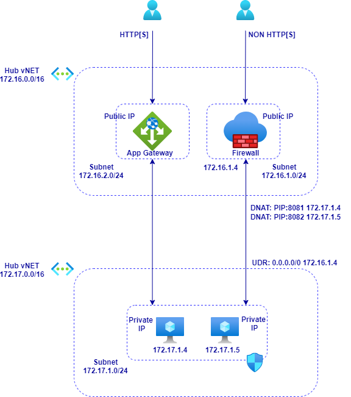

# **Azure Firewall and Application Gateway in Parallel in Hub <> Spoke**

# Contents
[Overview](#overview)

[Deployment](#deployment)

# Overview

This Terraform module deploys a Hub and Spoke vNET connected with vNET Peering. An Azure Firewall sits in the Hub along with a Services Subnet containing a W2K19 Server running as a Forest Root Domain Controller. Bastion provides secure access to the DC.

The Spoke vNET contains a single Subnet with a User Defined Route configured to push all outbound {internet} traffic through the Firewall.

This forms the basis of some of the prerequisites for deploying Windows Virtual Desktop.

Some useful documentation:

Azure Windows Virtual Desktop Requirements [documentation](https://docs.microsoft.com/en-gb/azure/virtual-desktop/overview#requirements)

Once deployed it should look like this:

Note that this stores state locally so a backend block with need to be added if required.

# Deployment

Steps:
- Log in to Azure Cloud Shell at https://shell.azure.com/ and select Bash
- Ensure Azure CLI and extensions are up to date:
  
  `az upgrade --yes`
  
- If necessary select your target subscription:
  
  `az account set --subscription <Name or ID of subscription>`
  
- Clone the  GitHub repository:
  
  `git clone https://github.com/mattweale/azure-addc-hub-spoke`
  
  - Change directory:
  
  `cd ./azure-addc-hub-spoke`
  - Initialize terraform and download the azurerm resource provider:

  `terraform init`

- Now start the deployment (when prompted, confirm with **yes** to start the deployment):
 
  `terraform apply`

Deployment takes approximately 20 minutes. 
## Explore and verify

After the Terraform deployment concludes successfully, the following has been deployed into your subscription:
- A resource group named **tf-hub-spoke-addc-rg** containing:
  - One Hub vNET containing a Firewall and an Application Gateway [with WAF].
  - One Spoke vNET containing two Virtual Machine with Windows 2019 Datacenter Edition running IIS.

Verify these resources are present in the portal.

Credentials for the VM are:
- User name: adminuser
- Password: Pa55w0rd123!

You can only connect to the VM via Bastion.

## Delete all resources

Delete the tf-hub-spoke-addc-rg resource group. This may take up to 20 minutes to complete. Check back to verify that all resources have indeed been deleted.

In Cloud Shell, delete the azure-hub-spoke-app-gateway directory:

`rm -rf azure-addc-hub-spoke`
